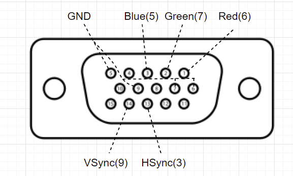

# Arduino * VGA出力で三原色を使う
https://github.com/smaffer/vgax  
VGAXライブラリを解読して自分なりに作成。

誰かのライブラリをこういう使い方していいのかな？
知らんけどとりあえず使う。ダメだったらforkする。

# 使い方
### 1
画像の通りにVGAとArduinoをつなげる。  
  

- RGBの配線には470Ωの抵抗
- VSync, HSyncには68Ωの抵抗

### 2
コンパイルする。

### おまけ
create_dot.htmlを使って簡単にドット絵を作成することができます。
絵を描いた後、大量の数値配列が生成されるので、それをコードにコピペすると良いです。

https://www.instagram.com/reel/CUDSD_kBIl1/?igshid=MzRlODBiNWFlZA==
